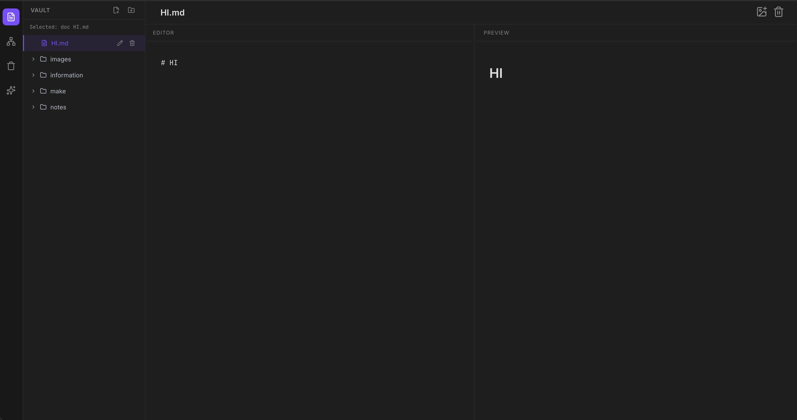
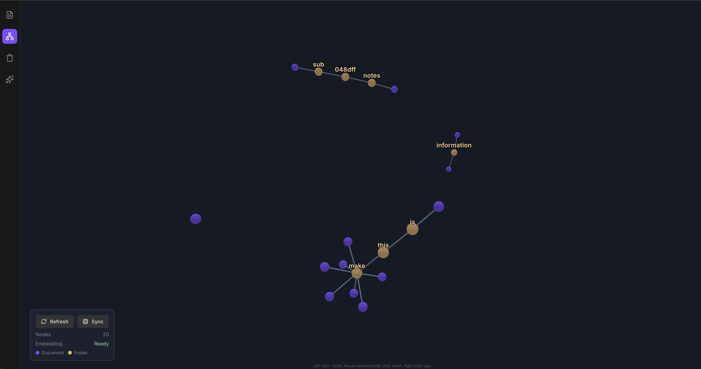

# SLO — Personal Knowledge Management

> Manage your documents anywhere, from any environment.

SLO is a **personal knowledge management tool** built for people who work across multiple environments — servers, local machines, and beyond.  
Through MCP (Model Context Protocol), you can create and edit documents from anywhere. SLO also supports markdown-based editing, a graph view, and a **RAG chatbot** powered by your own documents.  
All documents and files are stored in the `vault/` folder within the project directory.

---



---

## ✨ Features

- **Markdown Editor** — Clean, intuitive document writing and editing in Markdown
- **Graph View** — Visually explore connections between your documents
- **RAG Chatbot** — An AI assistant that answers questions based on your own written documents
- **MCP Integration** — Access and modify documents remotely via MCP from any environment



---

## 🚀 Getting Started

### Prerequisites

- **Python** >= 3.11
- **Ollama** — Required for embedding and LLM features ([Install Ollama](https://ollama.com))

### 1. Clone the Repository

```bash
git clone https://github.com/IkJun1/SLO.git
cd SLO
```

### 2. Install Dependencies

```bash
pip install -r requirements.txt
```

### 3. Configure Environment Variables

Copy the example env file and fill in your values.

```bash
cp .env.example .env
```

Key configuration fields in `.env`:

```dotenv
EMBEDDING_API_BASE=   # Embedding API base URL (e.g. http://localhost:11434)
EMBEDDING_MODEL=      # Embedding model name
LLM_API_BASE=         # LLM API base URL (e.g. http://localhost:11434)
LLM_MODEL=            # LLM model name
MCP_API_KEY=          # API key for MCP authentication
IS_HTTP=              # Set to true for HTTP, false for HTTPS
```

> **💡 Embedding & LLM Models**  
> Currently optimized for [Ollama](https://ollama.com)-based models.  
> Example: `LLM_API_BASE=http://localhost:11434`, `LLM_MODEL=llama3`

> **🔑 MCP_API_KEY**  
> Used to authenticate incoming MCP requests. You may set this manually, but for security it is recommended to generate a key using the provided script:
> ```bash
> python generate_mcp_api_key.py
> ```

> **🌐 IS_HTTP**  
> Set to `true` if running the app over HTTP, or `false` for HTTPS.

### 4. Run

```bash
python main.py
```

> **💡 Note**  
> By default, the server runs on `127.0.0.1:8000`. To change the host or port, edit `main.py`.

---

## 🧠 Embedding & RAG Chatbot

1. Set `EMBEDDING_API_BASE`, `EMBEDDING_MODEL`, `LLM_API_BASE`, and `LLM_MODEL` in your `.env` file.
2. Open the **Graph View** and click the **Sync** button to embed your documents.
3. Once syncing is complete, use the RAG chatbot to ask questions based on your documents.

---

## 🔌 MCP Usage

For MCP server setup and usage instructions, please refer to the directory below.

👉 [mcp-server](mcp-server/)

---

## 📄 License

MIT